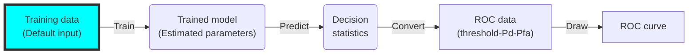
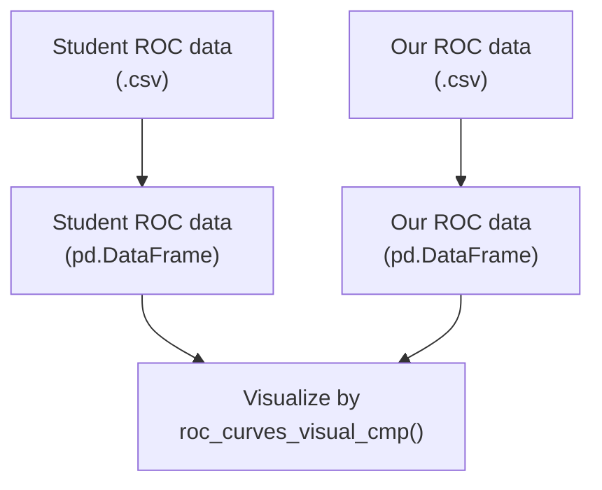

# ROC Curve Grader

## ROC curve generation procedure

ROC curves measure the performance of the trained classifier by applying it to a given dataset with a series of thresholds. For each threshold, we can compute the percentage of detection ($P_d$) and the percentage of false alarm ($P_{fa}$). The pair of $P_{d}$ and $P_{fa}$ can be represented by a point in the 2D plane, and these points outline the shape of the ROC curve. Let's set the horizontal axis to be $P_{fa}$, and the vertical axis to be $P_d$. The principle of a well-performing classifier is that, it can maintain a high $P_d$ while minimizing the $P_{fa}$. In other words, the ROC curve generated by such a classifier should be convex towards the top-left corner as much as possible. Figure 1 shows what a normal ROC curve looks like:


<p style="text-align: center;"> Figure 1. An example ROC curve</p>


To draw a ROC curve, we need to start by training the classifier. In ECE 580, we will require students to use the pre-specified model (such as LDA) in each exercise. There still could be a lot of variation introduced by different settings of hyperparameters and cross-validation folds partition. By the end of the training process, we should end up with the estimated parameters $\mathbf{w}$ and $b$. Then, the next step is to test the classifier on the testing set. We will calculate the decision statistics ($\lambda$) for each sample by $\mathbf{w^{T}x} + b$. To classify these samples, we should set a threshold ($\beta$) so that samples will fall into different classes depending on whether they are higher or lower than the threshold. Different samples may have very different decision statistics, but a good classifier should project these samples into two distant groups based on their true classes (as shown in Figure 2). This will guarantee that, there is a certain part of the decision statistics axis where we can achieve a high $P_d$ and a low $P_{fa}$ at the same time if we set the threshold to be a value in this interval. This portion is also depicted by the section of the ROC curve that is closest to the top-left corner.



<p style="text-align: center;"> Figure 3. ROC curve generation process</p>

Figure 3 summarizes the procedure to derive a ROC curve. Since we already specify the model and provide the training/testing set, the main factors that affect the shape of a ROC curve are the estimation of parameters and the selection of thresholds. The former directly determines the quality of a classifier (distance to the top-left corner), whereas the latter may also significantly affect the visualization if the selection is not representative enough for all differenet levels of $P_d$ and $P_{fa}$.


## Mistakes/Wrongdoings that Students could make

- Use the wrong model (eg. the question asks to use LDA, but the student uses logistics regression.)

  NOTE: We can detect the type of the model (classifier) if all students use `sklearn`. Each classification model in `sklearn` is encapsulated into a `class`, and we can check the type of a model by calling `isinstance()` (reference [link](https://stackoverflow.com/questions/14549405/python-check-instances-of-classes)). However, if some students choose to implement the model by themseleves, it is hard to find a straightforward way to verify the correctness of their model's implementation.
  
  ==State==: ⚠️
  
  ==Solution==: We will calculate the confidence interval of ABC based on all submissions (including the historical submissions). If a student's ABC is not in the interval, then we may need to manually check his/her code to see the implementation. <span style="color:#9900FF">But this method only detects a part of submissions with this mistake. What if they use a wrong model but end up with a reasonable ABC?</span>
  
- The `P_d` and `P_fa` column in the ROC data table is not sorted.
  
  This will cause the ROC curve to bounce back and forth, forming a messy graph. Pre-checking if the ROC data input is monotonic increasing/decreasing.
  
  ==State==: ✅
  
  ==Solution==: Use `diff()` to catch this error.
  
- Illegally tuning the ROC curve using the fake data generated by the trained model.

  ==State==: ✅

  ==Solution==: do not publicate the standard ROC curve to students.

- Hardcode function's output (estimated parameters, decision statistics, ROC data).

  ==State==: ✅

  ==Solution==: run the code twice with different input data, and check if the outputs are the same.

- Put $P_{fa}$ data into `P_d` column and $P_d$ data into `P_fa` column

  This will plot the curve which is the mirror symmetry of the true ROC curve over the diagnoal of the coordinator ($y = x$ or $P_d = P_{fa}$). 

  ==State==: ⚠️

  ==Solution==: In practice, a normal ROC curve tends to locate above the diagonal, so the mirror symmetry of it will be lower than the diagonal at every `P_fa` level. We can check this by measuring the AUC of a ROC curve and the AUC of the diagonal. If cond 1. the diagonal has a bigger AUC **AND** cond 2. the ROC curve has a bigger AUC when we flipped `P_d` and `P_fa`, then we can confirm that the student may mistakenly put $P_d$ and $P_fa$ data into the wrong columns. <span style="color:#9900FF">But there are some very special cases where the ROC curve is higher than the diagonal in some areas but lower in others, even though we didn't encounter one in ECE 580. Should we take this into condideration?</span> Maybe give some sample data and sample ROC curve to help them double-check.


## How dose this ROC curve grader work?

Generally, the ROC curve grader will grade a student's submission in two aspects - 1. whether a student is able to implement the whole workflow from model training to finally draw the curve; 2. the degree of similarity between a student's ROC curve and our standard ROC curve.

### Part 1

For the first aspect, we will provide students with a unified interface document containing all the functions that they are going to implement. In each step, there should be several functions with the defined function header and the empty function body. Students are prohibited to modify function headers, but allowed to use any helper functions if needed. Below is the examplar interface file that will be given to students:

```python
def train_classifier(train_X, train_y):
    """ Train the classifier and return the estimated parameters.
    
    Parameters:
        - train_X (array-like of shape (n_samples, n_features)): features of each
        obs in training data.
        - train_y (array-like of shape (n_samples,)): true class of each obs in
        training data.

    Returns:
        params (dictionary with two elements): estimated parameters of the model.
        The classifier has the form of: $f(X) = w^T * X + b$. `params` stores two
        elements - w and b.
        	- `w` (array-like of shape (n_features,)): parameter for each feature.
        	- `b` (np.float64): intercept term.
    """
    # TODO: implement this function
    params = {}
    params['w'] = ...
    params['b'] = ...

    return params


def get_decision_statistics(params, input_X):
    """ Generate decision statistics for each obs in the input.
    
    Parameters:
    	- params (dictionary with two elements): estimated parameters of the model.
        The classifier has the form of: $f(X) = w^T * X + b$. `params` stores two
        elements - w and b.
        	- `w` (list of length (n_features)): parameter for each feature.
        	- `b` (float): intercept term.
        - input_X (array-like of shape (n_samples, n_features)): features of each obs
        in input data.
        
    Returns:
    	decision_statistics (array-like of shape (n_samples,)): decision statistics for
    	each obs. This is calculated by $w^T * X + b$, where `w` and `b` are provided
    	in `params`. They should be placed in the same order as they are in `input_X`,
    	ie, the decision statistics of the first obs in `input_X` is the first element
    	in `decision_statistics`, and so on.
    """
    # TODO: implement this function
    decision_statistics = ...
    return decision_statistics


def get_ROC_data(thresholds, truth, decision_stats):
    """Generate a Pandas dataframe with the columns of thresholds, P_d and P_fa.

    Parameters:
        - thresholds (array-like of shape (n_thresholds,)): a list of thresholds.
        - truth (array-like of shape (n_samples,)): true class for each obs.
        - decision_stats (array-like of shape (n_samples,)): decision
        statistics of each observation.

    Returns:
        ROC_data (pd.DataFrame of shape (n_thresholds, 3)):
        The first column is the list of thresholds; The second column is the
        percentage of detection (P_d) under the given threshold, and the third
        column is the percentage of false alarm (P_fa) under the given threshold.
    """
    # TODO: implement this function
	ROC_data = pd.DataFrame(thresholds, columns=["thresholds"])
    ROC_data["P_d"] = ...
    ROC_data["P_fa"] = ...

    ROC_data.to_csv('student_ROC_data.csv')
    return ROC_data


def draw_one_ROC(ROC_data):
    """Draw one ROC curve.

    Parameters:
    - ROC_data (pd.DataFrame of shape (n_thresholds, 3)): a Pandas dataframe with three
    colomns.
    	- The first column is the `thresholds`;
    	- The second colummn is `P_d`;
    	- The third column is `P_fa`.
    """
    # TODO: implement this function
```

When we test the code, we will use the opaque-box testing, meaning that we will pass some test inputs and expect to see the correct output from the code. This automatic ROC curve grader won't open the opaque box. In other words, it won't check the function body of these functions in details. This is because we allow students to have different implementations as long as they have the same interface.

#### 1.1 Check the trained model (estimated parameters)

- check the type/length of `params` (type=`class.dict` and length = 2).
- check the type/length of `params['w']` (type=`np.ndarray` and shape = `(n_features,)`).
- Check the type of `params['b']` (type = `float`).
- Give two differnt training data and check if students hardcode the output.

#### 1.2 Check the decision statistics

- check the type/length of `decision_statistics` (type=`np.ndarray` and shape = `(n_samples,)`).
- Give two different `input_X` and check if students hardcode the output.

#### 1.3 Check the ROC data

- check the type/length of `ROC_data` (type=`pd.DataFrame` and length = `(n_thresholds, 3)`).
- check the order of `P_d` and `P_fa` (they should be either increasing or decreasing).
- check whether `P_d` and `P_fa` are placed into the wrong columns (we will do this in Part 2 actually).
- Give two different `thresholds` and check if students hardcode the output.

#### 1.4 Check the ROC curve

- Manually check

### Part 2



Reasons to use export the ROC data in Part 1:

- No need to run the code again to get the ROC data for Part 2;
- Collect all students' ROC data for future analysis

We won't ask students to upload their ROC data in `csv` file. Instead, the function that returns the ROC data will export it. In this way, we can avoid that some students may hardcode the ROC data in the file. It is also possible for some of them to hardcode the output in the function, but we will pass different input data to check this wrongdoing.

```
.csv file format for ROC data

threshold,P_d,P_fa
inf,0,0
4673.600000,0.01,0.00
```


## Memo

Give students some sample data and an expected ROC curve for them to debug their code
