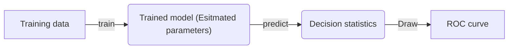

# ROC Curve Grader

## ROC curve generation process

ROC curves measure the performance of the trained classifier by applying it on a given dataset with a series of thresholds.

## Mistakes that Students could make

- Use the wrong model (eg. the question asks to use LDA, but the student uses logistics regression.)

  NOTE: We can detect the type of the model (classifier) if students all use sklearn
  since each model in sklearn is encapsulated into a class, and we can check the type of a model by calling `isinstance()` (reference [link](https://stackoverflow.com/questions/14549405/python-check-instances-of-classes)). However, if students choose
  to implement the model by themseleves, it is hard to find a straightforward way to verify the correctness of the model's implementation.

- The `thresholds` column in the ROC data table is not ordered
  This will cause the ROC curve to move back and forth, forming a messy plot.
  Pre-checking if the ROC data input is monotonic increasing/decreasing.

TODO:

-  Develop a way to measure the quality of the classifier students submitted.

