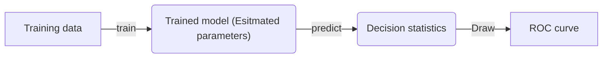

# ROC Curve Grader

## ROC curve generation procedure

ROC curves measure the performance of the trained classifier by applying it to a given dataset with a series of thresholds. For each threshold, we can compute the percentage of detection ($P_d$) and the percentage of false alarm ($P_{fa}$). The pair of $P_{d}$ and $P_{fa}$ can be represented by a point in the 2D plane, and these points outline the shape of the ROC curve. Let's set the horizontal axis to be $P_{fa}$, and the vertical axis to be $P_d$. The principle of a well-performing classifier is that, it can maintain a high $P_d$ while minimizing the $P_{fa}$. In other words, the ROC curve generated by such a classifier should be convex towards the top-left corner as much as possible. Figure 1 shows what a normal ROC curve looks like:

 Figure 1. An example ROC curve

To draw a ROC curve, we need to start by training the classifier. In ECE 580, we will require students to use the pre-specified model (such as LDA) in each exercise. There still could be a lot of variation introduced by different settings of hyperparameters and cross-validation folds partition. By the end of the training process, we should end up with the estimated parameters $\mathbf{w}$ and $b$. Then, the next step is to test the classifier on the testing set. We will calculate the decision statistics ($\lambda$) for each sample by $\mathbf{w^{T}x} + b$. To classify these samples, we should set a threshold ($\beta$) so that samples will fall into different classes depending on whether they are higher or lower than the threshold. Different samples may have very different decision statistics, but a good classifier should project these samples into two distant groups based on their true classes (as shown in Figure 2). This will guarantee that, there is a certain part of the decision statistics axis where we can achieve a high $P_d$ and a low $P_{fa}$ at the same time if we set the threshold to be a value in this interval. This portion is also depicted by the section of the ROC curve that is closest to the top-left corner.

 Figure 3. ROC curve generation process

Figure 3 summarizes the procedure to derive a ROC curve. Since we already specify the model and provide the training/testing set, the main factors that affect the outline of a ROC curve are the estimated parameters and the selection of thresholds. The former directly determines the quality of a classifier (distance to the top-left corner), whereas the latter may also significantly affect the visualization if the selection doesn't match the distribution of the decision statistics.

## Mistakes that Students could make

- Use the wrong model (eg. the question asks to use LDA, but the student uses logistics regression.)

  NOTE: We can detect the type of the model (classifier) if students all use sklearn since each model in sklearn is encapsulated into a class, and we can check the type of a model by calling `isinstance()` (reference [link](https://stackoverflow.com/questions/14549405/python-check-instances-of-classes)). However, if students choose to implement the model by themseleves, it is hard to find a straightforward way to verify the correctness of the model's implementation.
  
- The `thresholds` column in the ROC data table is not sorted.
  
  This will cause the ROC curve to move back and forth, forming a messy plot. Pre-checking if the ROC data input is monotonic increasing/decreasing.

## How this ROC curve grader works?

