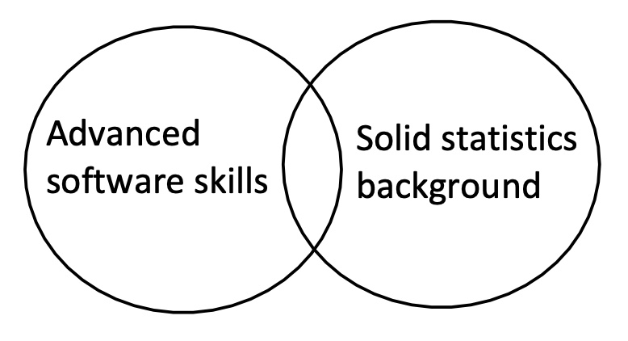

# **Independent Study Project Proposal**

#### Exploring and Experimenting Debugging/Testing Techniques in ML/DL Development

Zion Sheng
Department of ECE
Duke University

---
## Problem Description
The intuition comes from the testing/debugging theory and practice in software engineering. Similar to traditional software products, ML/DL applications can also be abstracted into a machine that returns some outputs given some inputs. The same expectation here is that the machine should be **implemented correctly** and **operate normally**. This requires testing/debugging during the ML/DL development.

---
## Current Situation
The topic is not well studied in ML/DL area yet. Some observations:
- [📖] Insufficient amount of publications. Braiek and Khomh (2020) [1] reports that there are only 37 relative papers published from 2007 to 2019. After 2020, still quite silent. ([link](https://scholar.google.com/scholar?hl=en&as_sdt=0%2C34&q=testing+deep+learning+models&btnG=))
- [🛠] Many mainstream ML/DL frameworks/libraries are not equipped with built-in or third-party testing/debugging modules.
- [🧑‍💻] Many practitioners still debug/test ML/DL applications with some prehistoric methods or no debugging/testing at all.

---
## Why not enough research and tools?

We definitely need reliable ML/DL applications. Since we still write code to implement these applications, it is **inevitable** to test and debug code. Plus, these bugs can hide everywhere, including the data, model implementation (esp in DL), and model training/testing procedures, which further increases the difficulty of the challenge.

---
## What we can do in this independent study?

### Theory side
⏭ Collect and read reviews/surveys on this topic to gain a broad overview of the history and recent discoveries.
⏭ Try to form an end-to-end testing/debugging solution by utilizing existing methods in each part. This serves as a theoretical blue-print if later we are set to develop an all-encompassing testing/debugging tool for a commonly-used ML/DL framework (e.g., `scikit-learn`).

---
## What we can do in this independent study?

### Practice side
⏭ Get familiar with existing tools by knowing what they can do and how to use them in real development.
⏭ Grading is essentially testing/debugging. We can apply these tools to ECE580 assignments grading, or help students to debug.
⏭ Case studies (debugging/testing on different ML/DL algorithms) could be very handy based on assignment questions.

---

## Reference
[1] Braiek, H. B., & Khomh, F. (2020). On testing machine learning programs. Journal of Systems and Software, 164, 110542.

